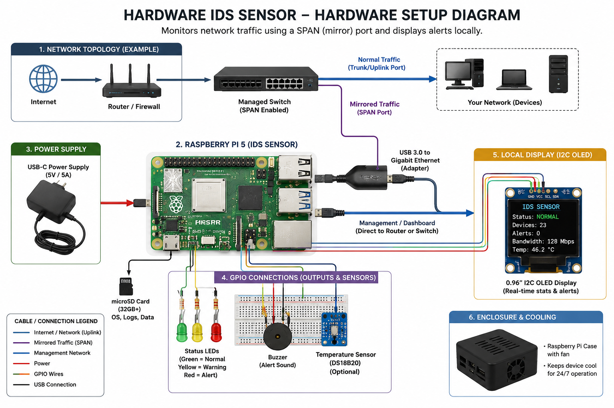

# Hardware Network Intrusion Detection Sensor (Hardware IDS)




*Image credit: https://www.knowledgehut.com/blog/security/intrusion-detection-system*

A hardware-based Network Intrusion Detection Sensor is a compact monitoring appliance that passively observes network traffic and looks for malicious activity or abnormal behaviour. Unlike a firewall, which actively blocks traffic, an IDS inspects mirrored traffic without interfering with the network.

This project centers on a Raspberry Pi connected to a managed switch configured with a mirror (SPAN) port. The switch duplicates network traffic and sends a copy to the Pi, allowing the IDS to analyse packets in real time.

## Overview

- Passive network monitoring appliance
- Uses a Raspberry Pi as the core processing unit
- Captures mirrored traffic from a switch SPAN port
- Detects attacks such as port scans, ARP spoofing, and suspicious DNS activity
- Stores alerts in a local SQLite database
- Presents findings on a lightweight Flask dashboard

## Key Capabilities

- Detect port scans by identifying a single source IP connecting to many destination ports
- Detect ARP spoofing through inconsistent IP-to-MAC associations
- Flag suspicious DNS queries using heuristics for risky domains and odd names
- Support optional I2C OLED display output for live summaries
- Support GPIO LEDs and buzzer alerts for real-time hardware signaling

## Getting Started

### Requirements

- Python 3.10+
- Raspberry Pi OS or another Linux environment for packet capture
- Root privileges to sniff raw network traffic
- A managed switch SPAN/mirror port connected to the Pi's capture interface

### Install dependencies

Use the provided requirements file to install all Python dependencies:

```bash
sudo apt update
sudo apt install -y python3 python3-pip python3-venv
python3 -m pip install --upgrade pip
python3 -m pip install -r requirements.txt
```

If you do not have `requirements.txt`, install the dependencies directly:

```bash
python3 -m pip install flask scapy pillow luma.oled gpiozero RPi.GPIO
```

### Setup

1. Connect the Raspberry Pi to a managed switch SPAN/mirror port.
2. Configure the capture interface and allowed MAC list if desired.
3. Attach optional hardware:
   - I2C OLED display on SDA/SCL
   - LEDs on GPIO 17 (green), 27 (yellow), 22 (red)
   - Buzzer on GPIO 18

### Launching the IDS

#### Option 1: Run directly

```bash
sudo python3 main.py --interface eth0
```

To restrict allowed devices:

```bash
sudo python3 main.py --interface eth0 --allowed-macs AA:BB:CC:DD:EE:FF,11:22:33:44:55:66
```

#### Option 2: Use the Raspberry Pi startup wrapper

This repository includes `start_pi.sh` for Pi-specific startup.

```bash
sudo bash start_pi.sh
```

You can also pass interface and allowed MACs using environment variables:

```bash
export IDS_INTERFACE=eth0
export IDS_ALLOWED_MACS=AA:BB:CC:DD:EE:FF,11:22:33:44:55:66
sudo bash start_pi.sh
```

### Open the dashboard

Navigate to:

```text
http://localhost:5000
```

If you are accessing from another machine on the same network, use the Pi's IP address instead:

```text
http://<pi-ip-address>:5000
```

## Project Structure

- `main.py` — IDS engine, packet detection, SQLite event logging, hardware integration, and Flask dashboard
- `templates/dashboard.html` — Web dashboard layout
- `static/css/style.css` — Dashboard styles
- `ids_events.db` — SQLite event store created automatically on first run

## Hardware Components

### Core Processing Unit
- **Raspberry Pi**
- **MicroSD card (32–128 GB)**
- **5V / 5A power supply**

### Network Capture
- **Managed Ethernet switch with SPAN support**
- **Ethernet cables (Cat6 or better)**
- **Dedicated network interface for mirrored traffic**

### Indicators & Alerts
- **I2C OLED display** — live summary of current alerts
- **Red / yellow / green LEDs** — status indicator lights
- **Buzzer / piezo speaker** — audible alert for critical detections

### Optional Enhancements
- **Temperature sensor (DS18B20)** for device monitoring
- **Cooling fan and heatsinks** for sustained operation
- **PoE HAT** for single-cable power and data

## Notes

- The IDS is passive and does not block traffic.
- Use this sensor for monitoring and alerting, and complement it with proper prevention tools.
- When hardware libraries are unavailable, the dashboard continues to work without OLED or GPIO features.

### Timezone / Timestamps

- Event timestamps shown in the dashboard are presented in the Europe/London timezone (BST when daylight saving is in effect). The project uses Python's `zoneinfo` when available, falls back to `pytz` if installed, and otherwise uses the system local timezone.
- If you want to ensure correct timezone handling on older Python versions, install `pytz`:

```bash
python3 -m pip install pytz
```

This makes event times read in local UK time on the dashboard and in the stored SQLite records.
